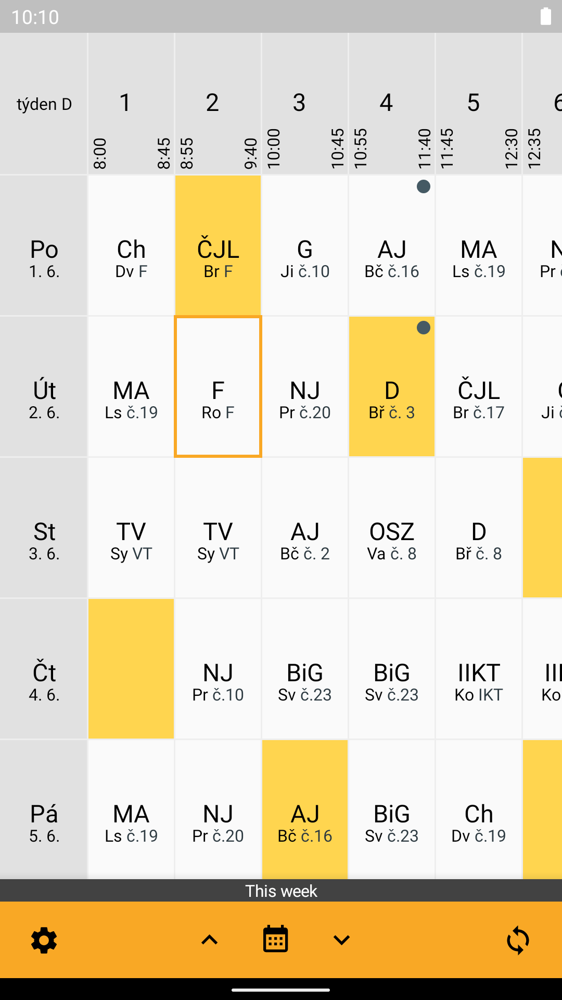
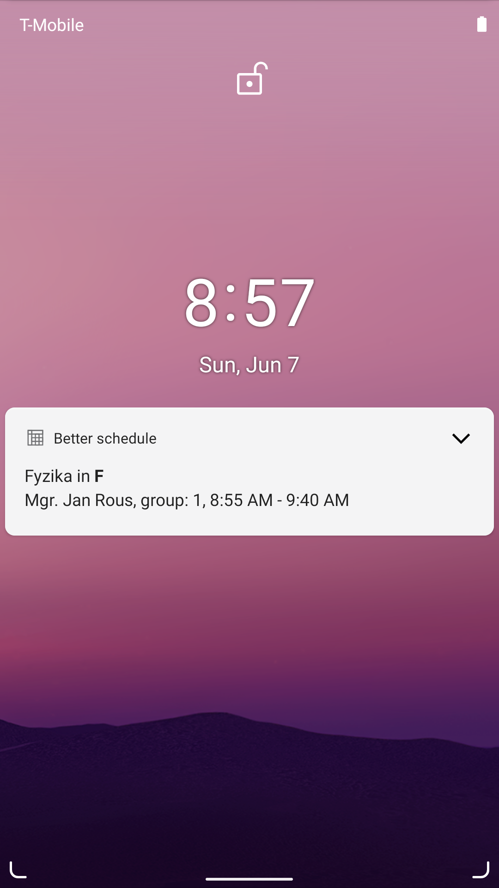

> **This is a personal fork of [Lepší rozvrh](https://gitlab.com/vitSkalicky/lepsi-rozvrh) by Vít Skalický**, modified by EOEIA. Licensed under GPL v3.

[Webová stránka](https://vitskalicky.gitlab.io/lepsi-rozvrh) / [Webpage](https://vitskalicky.gitlab.io/lepsi-rozvrh/en)

# Lepší rozvrh

Rychlejší a přehlednější klient pro rozvrh systému Bakaláři. Aplikaci jsem vytvořil,
protože mi docházela trpělivost s nepřehledností a hlavně pomalostí oficiální
aplikace.

## Hlavní funkce

- Velmi rychlé zobrazení rozvrhu — Kombinuje offline a online data, aby se rozvrh zobrazil do vteřiny.
- Plynulý offline režim — Lepší rozvrh si všechna načítaná data na pozadí uloží pro použití bez internetu.
- Trvalé upozornění — Kvůli další hodině už aplikaci ani nemusíte otevírat.
- Stylový widget — Další hodina nebo přehled celého dne vždy na domovské obrazovce.
- Přehledné rozhraní — Snadné a rychlé přepínání mezi týdny.
- Motivy - světlý, tmavý nebo Váš vlastní. Další motivy najdete na [https://vitskalicky.gitlab.io/lepsi-rozvrh/motivy/](https://vitskalicky.gitlab.io/lepsi-rozvrh/motivy/)
- Svobodný software — Žádné reklamy, žádné špehování, zdarma a navždy.

## Testovací server

Pokud nemáte účet na žádném Bakaláři serveru, můžete Lepší rozvrh vyzkoušet pomocí [testovacího serveru](https://gitlab.com/vitSkalicky/lepis-rozvrh-test-server).

1. Otevřete Lepší rozvrh
2. Ve výběru školy vyhledejte a vyberte "Testovací server pro Lepší rozvrh"
3. Přihlašovací jméno: `student`
4. Heslo je stejné jako přihlašovací jméno

⚠ Testovací server může být velmi pomalý, takže se Vám nejspíše nepovede přihlásit napoprvé. Zároveň Vás přibližně po hodině odhlásí.

Zdrojový kód a podrobnější instrukce k testovacímu serveru najdete zde: [https://gitlab.com/vitSkalicky/lepis-rozvrh-test-server](https://gitlab.com/vitSkalicky/lepis-rozvrh-test-server)

## Licence

Lepší rozvrh je *svobodný software* (free and open source software) licencovaný pod licencí [GPLv3][1], což znamená, že

- můžete aplikaci používat jakkoliv chcete
- studovat zdrojový kód a upravovat ho jakkoliv chcete
- sdílet s kýmkoliv chcete
- šířit vaše úpravy, ale musíte zachovat licenci (aby se uchovala svoboda této aplikace)

# Better schedule

This is faster and less confusing schedule client for Bakaláři. I created this app,
because I am annoyed by the slowness of the the official app.

## Main features

- Very fast schedule loading — Combines offline and online data to display schedule within a second.
- Seamless offline mode — Everything is cached in the background so that schedule can be shown even when you are offline.
- Persistent notification — You don't have to open the app to see next lesson any more.
- Beautiful widget — The next lesson or overview of the entire day always on your home screen.
- Simple interface — Easy switching between weeks.
- Themes - light, dark or your very own custom theme. Find more themes at [https://vitskalicky.gitlab.io/lepsi-rozvrh/motivy/](https://vitskalicky.gitlab.io/lepsi-rozvrh/motivy/)
- Free and open source software — No ads, no spying, free, forever.

## Testing server

If you don't have any Bakaláři account you can try out Better Schedule using the [testing server](https://gitlab.com/vitSkalicky/lepis-rozvrh-test-server).

1. Open Better Schedule
2. In school picker search and choose "Testovací server pro Lepší rozvrh"
3. Username: `student`
4. Password is the same as username

⚠ Testing server may be very slow so you might need several attempts to log in the first time. I also logs you out after roughly an hour.

Source code and more details on the testing server can be found here: [https://gitlab.com/vitSkalicky/lepis-rozvrh-test-server](https://gitlab.com/vitSkalicky/lepis-rozvrh-test-server)

## Licence

Better Schedule is a *free and open source software* (not just a freeware) licensed under [GPLv3][1].

# Screenshots

Více snímků obrazovky naleznete na [webové stránce](https://vitskalicky.gitlab.io/lepsi-rozvrh) / More screenshots can be found on the [webpage](https://vitskalicky.gitlab.io/lepsi-rozvrh/en)

[1]: https://www.gnu.org/licenses/gpl-3.0.en.html